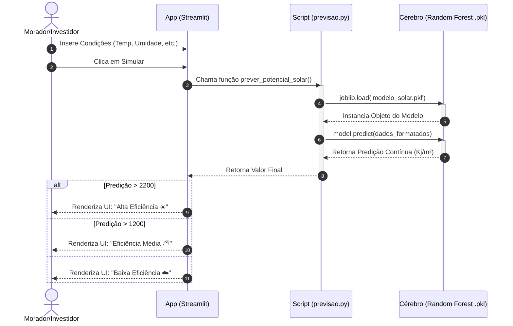
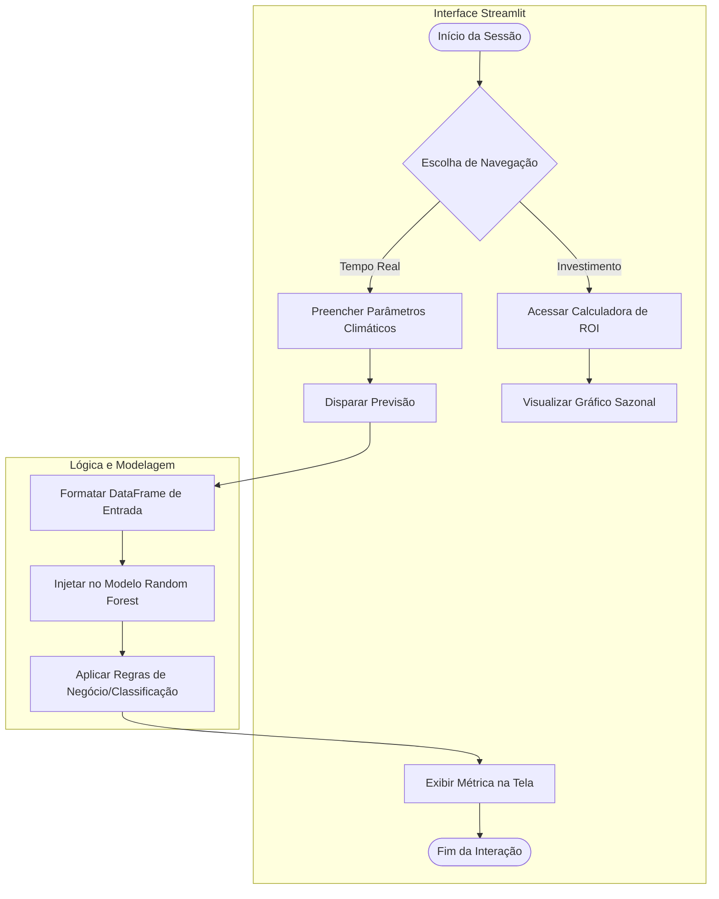

# ⚡ Projeto Solar Pampulha: Predição de Potencial Energético

> **Disciplina:** Engenharia de Software  
> **Foco:** Pipeline de Machine Learning para Dados Meteorológicos (INMET 2025)
---

## Visão Geral e Objetivos
Este projeto desenvolve uma solução de análise preditiva focada na geração de energia fotovoltaica na região da Pampulha, Belo Horizonte. Utilizando dados horários reais da estação meteorológica do **INMET**, buscamos investigar como diferentes variáveis climáticas interagem para influenciar o potencial de geração de energia solar.

**O que o projeto entrega:**
* **Análise Climática:** Identificação dos principais fatores atmosféricos que favorecem ou prejudicam a incidência solar na região.
* **Modelo Preditivo:** Um modelo de Machine Learning capaz de estimar a Radiação Global com base em medições meteorológicas comuns.
* **Dashboard Interativo:** Uma interface visual clara e reprodutível para explorar os dados e as predições do modelo.

###  Hipóteses de Trabalho
1. **Correlação Termodinâmica:** Acreditamos que existe uma correlação significativa entre a variação da temperatura (bulbo seco/orvalho) e os níveis de umidade relativa com os picos de radiação global. Esperamos que o modelo consiga usar essas variáveis conjuntas para identificar as melhores janelas de potencial fotovoltaico.
2. **Impacto de Fatores Secundários:** Hipotetizamos que variáveis como velocidade do vento e pressão atmosférica influenciam indiretamente a incidência solar, possivelmente por estarem atreladas à movimentação de massas de ar e formação de nebulosidade. Queremos investigar se a inclusão dessas features melhora a capacidade do modelo de prever quedas bruscas na radiação.

---

##  O Dataset
* **Fonte:** Instituto Nacional de Meteorologia (INMET) - Estação A521 (Pampulha/BH).
* **Ano:** 2025 (Dados Horários).
* **Variáveis Chave:** Radiação Global (Kj/m²), Temperatura (Máxima/Mínima/Orvalho), Umidade Relativa, Velocidade/Direção do Vento e Pressão Atmosférica.
* **Desafio Técnico:** Limpeza do cabeçalho de metadados da estação, tratamento de valores ausentes (NaN) e adequação dos registros noturnos (onde a radiação é naturalmente nula).

---

## Squad e Atribuições
Para garantir que o pipeline seja end-to-end, dividimos as responsabilidades priorizando perfis complementares, mas com todos atuando ativamente no código:

*  Emmanuel Magalhães | **Engenheiro de Dados (Data Prep)**  
    *Focado em: Ingestão dos dados brutos, tratamento estrutural do CSV do INMET, lida com valores nulos/noturnos e garantia de que o dataset processado esteja pronto para consumo.*
*  Felipe Pereira | **Cientista de Dados (EDA & Modelagem)**  
    *Focado em: Análise Exploratória (EDA) para validar as hipóteses, seleção das melhores features, treinamento do modelo de Machine Learning e avaliação de suas métricas.*
*  Mateus Rabelo | **Engenheiro de Software (Viz & Ops)**   
    *Focado em: Integração do pipeline, desenvolvimento do Dashboard interativo, elaboração dos diagramas UML e gestão do Backlog Ágil no GitHub Projects.*

---
## Arquitetura do Sistema (UML)

### 1. Diagrama de Sequência (Comportamental)
Este diagrama ilustra a interação em tempo real entre o usuário, a interface do Dashboard e o modelo de Machine Learning exportado.

### 2. Diagrama de Atividades (Fluxo de Processamento)
Mapeamento das ações do sistema divididas entre a Interface do Usuário (Frontend) e o Processamento de Dados (Backend).

---

## Stack Tecnológica
* **Linguagem:** Python 3.10+
* **Manipulação:** Pandas & NumPy
* **Inteligência:** Scikit-Learn
* **Visualização:** Matplotlib, Seaborn e Streamlit (ou equivalente)
* **Gestão e Versionamento:** GitHub (Projects)
