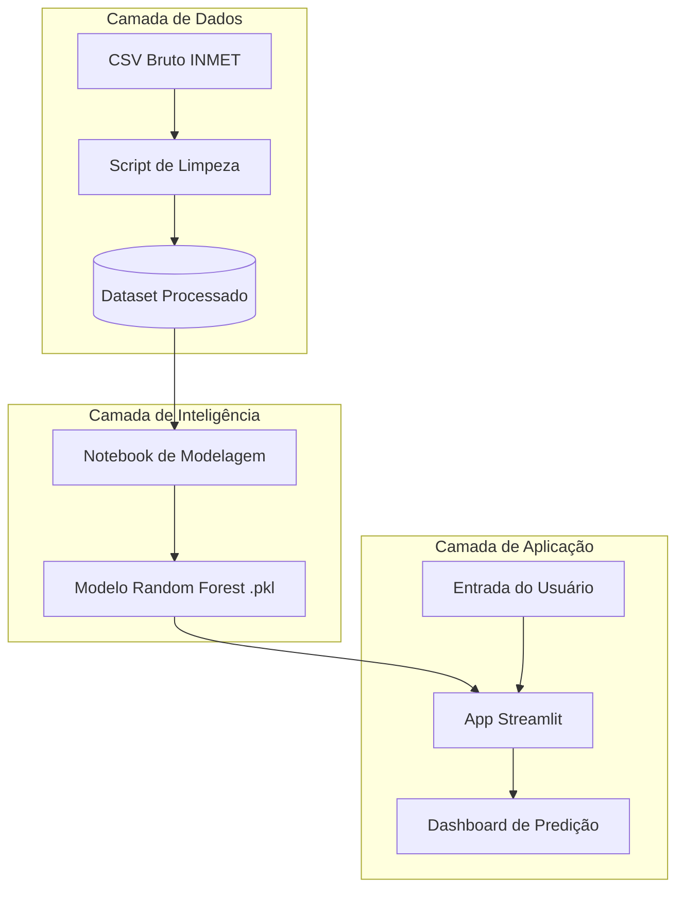
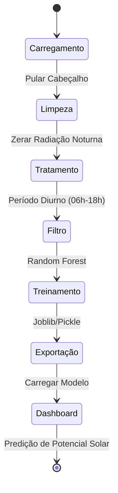

# Diagramas UML - Projeto Solar Pampulha

## 1. Diagrama de Componentes (Arquitetura)
Aqui está a arquitetura do nosso pipeline de dados:

## 2. Diagrama de Atividades (Fluxo)
Aqui está o passo a passo de como os dados se movem:

