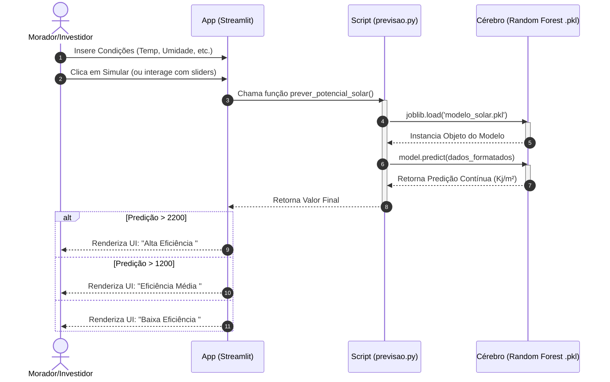
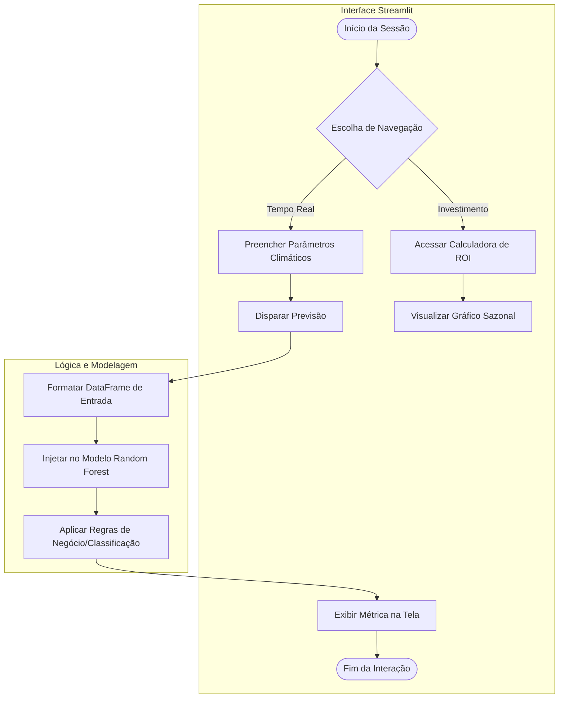

# Diagramas UML - Projeto Solar Pampulha

## 1. Diagrama de Sequência (Comportamental)
Este diagrama ilustra a interação em tempo real entre o usuário (Morador/Investidor), a interface do Dashboard e o modelo de Machine Learning exportado.

## 2. Diagrama de Atividades (Fluxo de Processamento)
Mapeamento das ações do sistema divididas entre a Interface do Usuário e o Processamento de Dados.

